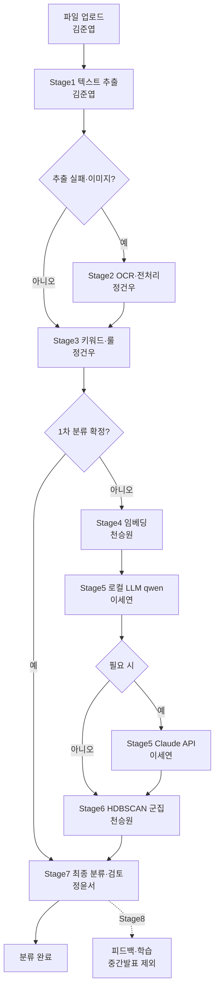

# 프로젝트 컨벤션

> AI 기반 파일 분류 시스템 | 한양대학교 ERICA 데이터처리 기업 프로젝트
> 모든 팀원은 코드 작성 전 이 문서를 숙지할 것
>
> **GitHub를 처음 쓰는 팀원:** `[GITHUB_BEGINNER.md](./GITHUB_BEGINNER.md)` 먼저 읽기 (clone → 브랜치 → commit → PR)

---

## 1. 브랜치 전략

### 중간 발표 범위 (MVP)

**Stage 8(피드백·학습) 전까지** 구현·발표한다. (플로우차트 v2 기준)

| 포함 (Stage 0~7) | 제외 (Stage 8+) |
|------------------|-----------------|
| 업로드 → ①텍스트 추출 → ②OCR → ③룰분류 → ④임베딩 → ⑤LLM → ⑥군집 → ⑦최종분류·검토 | 사용자 피드백 학습(Fine-tune/LoRA), 모델 배포 |

### 브랜치 구조 (플로우차트 v2 · Stage 번호 정렬)

```
main
├── feature/backend-server       ← 서버 통합 (main.py 파이프라인 순서 연결)
├── feature/frontend-upload      ← 김준엽: 파일 업로드 UI
├── feature/stage1-extract       ← 김준엽: Stage1 텍스트 추출 (PDF/HWP/DOCX/TXT, 1500×3)
├── feature/stage2-ocr           ← 정건우: Stage2 OCR·전처리 (이미지·스캔 PDF, 노이즈 제거)
├── feature/stage3-rule          ← 정건우: Stage3 키워드·룰·파일명 1차 분류
├── feature/stage4-embedding     ← 천승원: Stage4 임베딩·벡터화 (Sentence-BERT 등)
├── feature/stage5-llm-local     ← 이세연: Stage5 로컬 LLM (qwen2.5 Ollama)
├── feature/stage5-llm-claude    ← 이세연: Stage5 외부 API (Claude, 필요 시만)
├── feature/stage6-cluster       ← 천승원: Stage6 HDBSCAN 군집
├── feature/stage7-review        ← 정윤서: Stage7 최종 분류·검토 UI
└── hotfix/...
```

**Deprecated (v1 브랜치 · merge 후 정리)**

- `feature/stage0-extract` → `feature/stage1-extract`
- `feature/ocr-fallback` → `feature/stage2-ocr`
- `feature/rule-classify` → `feature/stage3-rule`
- `feature/semantic-cluster` → `feature/stage4-embedding` + `feature/stage6-cluster` 로 분리
- `feature/llm-local-qwen` → `feature/stage5-llm-local`
- `feature/llm-claude` → `feature/stage5-llm-claude`
- `feature/review-ui` → `feature/stage7-review`
- `feature/stage1-evidence`, `feature/stage2-cluster`, `feature/stage3-classify` (구 통합 코드)

### 규칙

- `main` 브랜치에 **직접 push 금지**
- 작업은 반드시 **본인 담당 `feature/` 브랜치**에서 진행 (브랜치 먼저 생성 → 코드 작성)
- 완료 후 GitHub Pull Request → 팀원 1명 이상 리뷰 후 merge
- PR 제목 형식: `[OCR] PDF OCR 폴백 구현`, `[LLM Claude] EvidencePackage 분류 API` 처럼 **담당 파트 명시**

---

## 2. 커밋 메시지

### 형식

```
<type>: <내용>
```

### type 종류


| type       | 사용 상황            |
| ---------- | ---------------- |
| `feat`     | 새 기능 추가          |
| `fix`      | 버그 수정            |
| `refactor` | 동작 변화 없는 코드 개선   |
| `docs`     | 문서, 주석 수정        |
| `test`     | 테스트 코드 추가/수정     |
| `chore`    | 패키지 설치, 설정 파일 변경 |


### 예시

```bash
git commit -m "feat: PDF 텍스트 추출 3구간 분할 로직 구현"
git commit -m "feat: Claude API 비동기 호출 및 Semaphore 제한 추가"
git commit -m "fix: xxhash 중복 감지 캐시 키 충돌 수정"
git commit -m "refactor: EvidencePackage 임베딩 계산 Lazy Singleton 적용"
git commit -m "chore: sentence-transformers 패키지 추가"
git commit -m "docs: Stage 3 분류 로직 주석 보완"
```

### 규칙

- 한국어 작성 권장
- 50자 이내로 핵심만 작성
- 과거형 금지 (`구현했다` ❌ → `구현` ✅)

---

## 3. 폴더 및 파일 구조

```
project-root/
├── rules/
│   └── CONVENTIONS.md        ← 이 파일
│
├── server/                   ← 서버 담당
│   ├── main.py
│   ├── config/
│   │   ├── keywords.json     ← 팀 키워드 설정 (Git 관리)
│   │   └── loader.py         ← JSON 로드
│   ├── pipeline/
│   │   ├── __init__.py
│   │   ├── pre_stage.py              # 캐시·유효성 (업로드 직후)
│   │   ├── stage1_extract.py         # Stage1 텍스트 추출 (구 stage0_extract)
│   │   ├── stage2_ocr.py             # Stage2 OCR·전처리
│   │   ├── stage3_rule.py            # Stage3 룰·키워드 분류
│   │   ├── stage4_embedding.py       # Stage4 임베딩
│   │   ├── stage5_llm_local.py       # Stage5 로컬 LLM
│   │   ├── stage5_llm_claude.py      # Stage5 Claude API
│   │   ├── stage6_cluster.py         # Stage6 HDBSCAN
│   │   ├── stage7_review.py          # Stage7 최종·검토 (신규)
│   │   ├── stage8_feedback.py        # Stage8 학습 (중간 발표 제외)
│   │   └── (구) stage0_extract, stage1_evidence, stage3_classify … # 이전 통합
│   ├── models/
│   │   ├── __init__.py
│   │   └── schemas.py        ← 공용 데이터 구조 (전 파트 참고)
│   ├── db/
│   │   ├── __init__.py
│   │   └── cache.py
│   ├── docs/                 ← 회의 템플릿 등 팀 문서
│   ├── .env                  ← 깃 업로드 금지
│   ├── .env.example
│   ├── .gitignore
│   ├── requirements.txt
│   └── README.md             ← 서버 실행·테스트 메뉴얼
│
├── frontend/                 ← 프론트엔드 담당
│   └── ...
│
└── README.md
```

### 파일명 규칙

- Python 파일: `snake_case.py`
- 설정/문서 파일: `UPPER_CASE.md` 또는 `kebab-case.md`
- 파이프라인 모듈: `stage{번호}_{역할}.py` 또는 역할명 (`ocr_fallback.py`, `rule_classify.py`, `stage3_llm_claude.py` 등)
- **담당 브랜치와 1:1** 로 파일을 맞추고, 타 담당 파일은 PR에서 수정하지 않음

### 파이프라인 목표 파일 (플로우차트 v2 ↔ `main.py` 호출 순서)

| Stage | 단계 | 목표 파일 | 담당 |
|:-----:|------|-----------|------|
| — | Pre (캐시·검증) | `pre_stage.py` | 서버 |
| 1 | 텍스트 추출 | `stage0_extract.py` (향후 `stage1_extract.py` 예정) | 김준엽 — PDF/HWP/DOCX/TXT, 1500×3 |
| 2 | OCR·전처리 | `stage2_ocr.py` | 정건우 — 이미지·스캔 PDF, 노이즈 제거 |
| 3 | 키워드·룰 1차 분류 | `stage3_rule.py` | 정건우 — 키워드·**파일명 규칙**, ppt/pptx |
| 4 | 임베딩·벡터화 | `stage4_embedding.py` | 천승원 — Sentence-BERT 등 |
| 5 | LLM 심층 분석 | `stage5_llm_local.py`, `stage5_llm_claude.py` | 이세연 — **로컬 qwen 우선**, Claude는 필요 시 |
| 6 | 군집화 | `stage6_cluster.py` | 천승원 — HDBSCAN, 유사 문서 그룹 |
| 7 | 최종 분류·검토 | `stage7_review.py` + 프론트 | 정윤서 — LLM+군집 결과 종합, UI |
| 8 | 피드백·학습 | `stage8_feedback.py` | 중간 발표 **제외** |

> `EvidencePackage`는 Stage4 이후·Stage5 LLM **입력 직전**에 조립 (서버 통합 또는 `stage4_embedding`에서 생성 — 팀 협의).


---

## 4. Python 코드 스타일

### 기본 원칙

- Python 3.10 이상 기준
- 들여쓰기: **스페이스 4칸** (탭 금지)
- 한 줄 최대 **100자**
- 파일 인코딩: **UTF-8**

### 네이밍

```python
# 변수, 함수: snake_case
file_hash = compute_hash(file_bytes)
def run(file_bytes: bytes, filename: str) -> dict:

# 클래스, Enum: PascalCase
class EvidencePackage:
class Category(str, Enum):

# 상수: UPPER_SNAKE_CASE
SUPPORTED_EXTENSIONS = {'.pdf', '.docx', '.hwp'}
MAX_FILE_SIZE_MB = 50
```

### 타입 힌트 필수

```python
# ✅ 올바른 예
def run(file_bytes: bytes, filename: str, modified_at: float) -> dict:

# ❌ 잘못된 예
def run(file_bytes, filename, modified_at):
```

### 파이프라인 모듈 함수 이름 통일

모든 파이프라인 모듈의 메인 진입 함수는 `run()` 으로 통일한다.

```python
# 모든 stage 모듈 공통 형식
def run(...) -> dict:
    ...
```

### 예외 처리 필수

파이프라인 함수 내에서 예외가 발생해도 서버가 죽으면 안 된다.
반드시 `try/except` 로 감싸고 검토 큐로 보낼 것.

```python
# ✅ 올바른 예
def run(file_bytes: bytes, filename: str, ext: str) -> dict:
    try:
        # 처리 로직
        ...
    except Exception as e:
        return {"status": "failed", "reason": str(e)}

# ❌ 잘못된 예 — 예외 그냥 던지기
def run(file_bytes: bytes, filename: str, ext: str) -> dict:
    text = extract(file_bytes)  # 여기서 터지면 서버 전체 죽음
    ...
```

### 반환 status 값 통일

파이프라인 함수의 **반환 딕셔너리**에서 `status` 값은 아래로 통일한다.  
(`main.py` WebSocket 진행 이벤트의 `stage`/`status` 문자열은 UI 계약에 따라 별도 정의 가능)


| status           | 의미                       |
| ---------------- | ------------------------ |
| `"ok"`           | 정상 처리 완료                 |
| `"success"`      | 텍스트 추출 성공 (Stage 0)      |
| `"ocr_fallback"` | OCR 폴백으로 성공 (Stage 0)    |
| `"cached"`       | xxhash 캐시 히트 (Pre-stage) |
| `"failed"`       | 처리 실패 → 검토 큐 이동          |
| `"review_queue"` | 유효성 검사 실패 → 검토 큐 이동      |


---

## 5. API 키 및 보안

- `.env` 파일은 **절대 깃에 올리지 않는다**
- API 키는 코드에 직접 작성 금지
- **Claude API** 호출은 `pipeline/stage5_llm_claude.py` 한 곳에서만 수행
- 다른 모듈에서 `anthropic` 직접 import 금지
- **로컬 LLM (qwen/Ollama)** 은 `pipeline/stage5_llm_local.py` (이세연) 에서만 호출

```python
# ✅ 올바른 예 — .env에서 읽기
import os
from dotenv import load_dotenv
load_dotenv()
api_key = os.getenv("ANTHROPIC_API_KEY")

# ❌ 잘못된 예 — 코드에 직접 입력
api_key = "sk-ant-xxxxxxxxxxxx"
```

---

## 6. 공용 데이터 구조 (`schemas.py`)

- `EvidencePackage`, `ClassifyResult`, `FeedbackLog`, `FinalizedDocument`, `Category` 는 `**models/schemas.py` 에서만 정의**
- 각 모듈에서 사용 시 반드시 import해서 사용
- 구조 변경 시 팀원 전체에게 공유 후 수정

```python
# ✅ 올바른 import
from models.schemas import EvidencePackage, Category

# ❌ 각 파일에 중복 정의 금지
@dataclass
class EvidencePackage:  # stage1_evidence.py 안에 또 정의하는 것 금지
    ...
```

---

## 7. 의존성 관리

- 패키지 추가 시 반드시 `requirements.txt` 에 추가 후 커밋
- 버전은 고정하지 않고 최신 유지 (단, `anthropic` 라이브러리는 버전 고정 권장)
- 파일 업로드 API 사용 시 `python-multipart` 필요 (서버 담당자가 requirements에 포함 여부 확인)
- 설치 명령어:

```bash
cd server
pip install -r requirements.txt
```

---

## 8. 깃 관련 주의사항

### `.gitignore` 필수 포함 항목

```
.env
__pycache__/
*.pyc
*.pyo
cache.db
uploads/
*.egg-info/
.DS_Store
```

### push 전 체크리스트

- `feature/` 브랜치에서 작업했는가
- `.env` 파일이 스테이징에 포함되지 않았는가 (`git status` 확인)
- `requirements.txt` 업데이트했는가 (새 패키지 설치 시)
- 커밋 메시지 형식이 맞는가

---

## 9. 서버 실행 방법

```bash
cd server

# 최초 1회
pip install -r requirements.txt
pip install python-multipart   # 파일 업로드용
cp .env.example .env           # API 키 설정

# 개발 환경 (자동 재시작)
uvicorn main:app --reload --host 0.0.0.0 --port 8000

# API 문서 확인
http://localhost:8000/docs
```

---

## 10. 최종 파이프라인 (플로우차트 v2)

`main.py` `run_pipeline` 은 **Stage 1 → 7** 순서로 호출한다.

### 10-1. Stage별 요약 (공식 플로우차트)

| Stage | 이름 | 담당 | 핵심 |
|:-----:|------|------|------|
| — | 파일 업로드 | 김준엽 | 드래그앤드롭·폴더 |
| **1** | 텍스트 추출 | 김준엽 | PDF/HWP/DOCX/TXT, 한국어 메인, 1500×3 |
| **2** | OCR·전처리 | 정건우 | 이미지·스캔 PDF, 노이즈 제거 |
| **3** | 키워드·룰 1차 분류 | 정건우 | 키워드·파일명 규칙, ppt/pptx |
| **4** | 임베딩·벡터화 | 천승원 | Sentence-BERT, 벡터 공간 |
| **5** | LLM 심층 분석 | 이세연 | qwen2.5(Ollama) 우선, Claude 선택, 프롬프트 |
| **6** | 군집화 | 천승원 | HDBSCAN, 유사 문서·신규 카테고리 제안 |
| **7** | 최종 분류·검토 | 정윤서 | LLM+군집 종합, 신뢰도·UI |
| **8** | 피드백·학습 | (후속) | 오분류 수정·학습 — **중간 발표 제외** |

### 10-2. 전체 플로우 (mermaid)



### 10-3. Stage 5 LLM (이세연) — 동작 원칙

- **로컬 LLM(qwen2.5 3B/7B, Ollama)** 을 기본으로 사용 (비용·프라이버시).
- 신뢰도 부족·복잡 케이스만 **Claude API** 호출.
- 입력: 추출 텍스트(1500×3), Stage4 임베딩, `EvidencePackage`(프롬프트 컨텍스트).
- 출력: `category`, `confidence`, `reason`, `keywords` (JSON).

### 10-4. 설정 파일

| 파일 | Stage | 용도 |
|------|:-----:|------|
| `config/keywords.json` | 3 | 룰·키워드 (파일명·본문 협의) |
| `config/embedding.json` (예정) | 4 | SBERT 모델명 등 |
| `config/cluster.json` (예정) | 6 | HDBSCAN 파라미터 |
| `.env` | 5 | `ANTHROPIC_API_KEY`, `MAX_CONCURRENT_LLM`, Ollama URL |

### 10-5. 현재 코드 vs v2 (갭)

| v2 Stage | 현재 server |
|:--------:|-------------|
| 1 추출 | `stage0_extract.py` (이름만 다름) ✅ |
| 2 OCR | `stage2_ocr.py` 스텁 (실 OCR는 담당자 확장) |
| 3 룰 | `stage3_rule.py` (파일명 키워드) ✅ |
| 4 임베딩 | `stage4_embedding.py` → `stage1_evidence` 위임 ✅ |
| 5 LLM | `stage5_llm_claude` ✅ / `stage5_llm_local` ✅ (Qwen→Claude) |
| 6 군집 | `stage6_cluster.py` (HDBSCAN) ✅ |
| 7 검토 | `stage7_review.py` + API ✅ |
| 순서 | ✅ `main.py`: 추출→OCR→룰→임베딩→LLM→군집→버전→검토 |


---

## 11. 팀원별 담당 및 인터페이스 계약 (v2)


| 담당 | 브랜치 | Stage |
|------|--------|:-----:|
| 김준엽 | `feature/frontend-upload`, `feature/stage1-extract` | 업로드, 1 |
| 정건우 | `feature/stage2-ocr`, `feature/stage3-rule` | 2, 3 |
| 천승원 | `feature/stage4-embedding`, `feature/stage6-cluster` | 4, 6 |
| 이세연 | `feature/stage5-llm-local`, `feature/stage5-llm-claude` | 5 |
| 정윤서 | `feature/stage7-review` | 7 |
| 서버 | `feature/backend-server` | Pre + 파이프라인 연결 |


### 함수 계약 (변경 시 서버 담당자 사전 공지)


| Stage | 파일 | 메인 함수 | 반환 |
|:-----:|------|-----------|------|
| Pre | `pre_stage.py` | `run(file_bytes, filename, modified_at)` | `dict` |
| 1 | `stage0_extract.py` | `run(file_bytes, filename, ext)` | `dict` |
| 2 | `stage2_ocr.py` | `run(file_bytes, filename, ext)` | `dict` |
| 3 | `stage3_rule.py` | `run(filename, ext, xxhash, version_hint="")` | `ClassifyResult \| None` |
| 4 | `stage4_embedding.py` | `run(text_chunks, ...)` → `EvidencePackage` 조립 포함 가능 | `list[float]` / `EvidencePackage` |
| 5 | `stage5_llm_local.py` | `async classify_with_qwen(pkg)` | `dict` |
| 5 | `stage5_llm_claude.py` | `async classify_with_claude(pkg)` | `dict` |
| 6 | `stage6_cluster.py` | `run(job_embeddings)` | `list[dict]` 군집 메타 |
| 7 | `stage7_review.py` | `run(llm_results, clusters)` | `list[ClassifyResult]` |
| 8 | `stage8_feedback.py` | `save_feedback` … | — (MVP 제외) |


> 함수 시그니처 변경은 **반드시** `feature/backend-server` 담당자와 협의 후 `schemas.py` 와 함께 수정.

### 키워드·설정 파일 (팀 공동 관리)


| 파일                            | 수정 주체       | 용도               |
| ----------------------------- | ----------- | ---------------- |
| `server/config/keywords.json` | 팀 합의 후 PR | ⚠️ 현재 본문용 — 룰용은 `keywords_filename.json` 분리 예정 |
| `server/.env`                 | 서버 담당 (비공개) | API 키, 동시 호출 수 등 |


---

## 12. API 결과 구조 (프론트·운영 참고)

`GET /result/{job_id}` 응답 요약:


| 필드               | 의미                                  |
| ---------------- | ----------------------------------- |
| `results`        | 자동 분류 **완료**된 파일 (`/confirm` 대상)    |
| `review_queue`   | 분류 **실패·보류** 파일 (현재 `/confirm` 미지원) |
| `version_groups` | Stage 4 버전 그룹                       |


