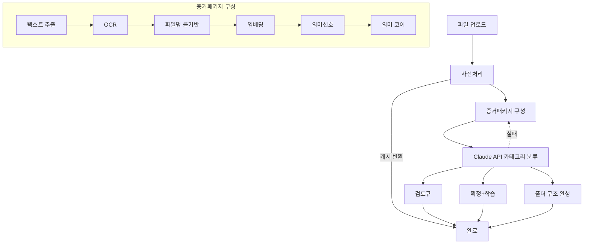

# 프로젝트 컨벤션 (팀 공통)

> AI 기반 파일 분류 시스템 | 한양대학교 ERICA 데이터처리 기업 프로젝트  
> **모든 팀원**이 PR 전에 읽는 문서입니다.

| 문서 | 용도 |
|------|------|
| **이 파일** | 브랜치·커밋·담당·파이프라인·협업 |
| [GITHUB_BEGINNER.md](./GITHUB_BEGINNER.md) | Git 사용법 |
| [backend/docs/CONVENTIONS.md](../backend/docs/CONVENTIONS.md) | 백엔드 코드·Stage 함수·WebSocket 상세 |
| [backend/README.md](../backend/README.md) | 서버 실행·API 테스트 |
| [CONVENTIONS.local.md.example](./CONVENTIONS.local.md.example) | 개인 메모 템플릿 (git 제외) |

---

## 1. 브랜치 전략

### 중간 발표 범위 (MVP)

**Stage 8(피드백·학습) 전까지** 구현·발표한다. (플로우차트 최종 기준)

| 포함 (Stage 0~7) | 제외 (Stage 8+) |
|------------------|-----------------|
| 업로드 → ①텍스트 추출 → ②OCR → ③룰분류 → ④임베딩 → ⑤LLM → ⑥군집 → ⑦최종분류·검토 | 사용자 피드백 학습(Fine-tune/LoRA), 모델 배포 |

### 브랜치 구조

```
main
├── feature/backend-server       ← 백엔드 통합 (main.py 파이프라인 연결)
├── feature/frontend-upload      ← 김준엽: 파일 업로드 UI
├── feature/stage1-extract       ← 김준엽: Stage1 텍스트 추출
├── feature/stage2-ocr           ← 정건우: Stage2 OCR·전처리
├── feature/stage3-rule          ← 정건우: Stage3 룰·파일명 분류
├── feature/stage4-embedding     ← 천승원: Stage4 임베딩
├── feature/stage5-claude        ← 이세연: Stage5 Claude API
├── feature/stage6-cluster       ← 천승원: Stage6 군집 (HDBSCAN 미사용)
├── feature/stage7-review        ← 정윤서: Stage7 검토 UI
└── hotfix/...
```

### 규칙

- `main`에 **직접 push 금지**
- **본인 담당 `feature/` 브랜치**에서만 작업
- PR → 팀원 **1명 이상 리뷰** 후 merge
- PR 제목: `[OCR] …`, `[LLM] …` 처럼 **담당 파트 명시**

---

## 2. 커밋 메시지

```
<type>: <내용>
```

| type | 사용 상황 |
|------|-----------|
| `feat` | 새 기능 |
| `fix` | 버그 수정 |
| `refactor` | 동작 동일, 구조 개선 |
| `docs` | 문서 |
| `test` | 테스트 |
| `chore` | 설정·패키지 |

- 한국어, 50자 이내, 과거형 금지 (`구현` ✅ / `구현했다` ❌)

---

## 3. 저장소 구조 (역할 분리)

```
project-root/
├── rules/              ← 팀 공통 (이 문서, Git 가이드)
├── backend/            ← FastAPI·파이프라인 (백엔드 팀)
├── frontend/           ← UI (프론트 팀, 예정)
├── src/                ← CLI·GUI (레거시, 별도 실행)
└── docs/               ← 프로젝트 아키텍처 문서
```

- **백엔드 코드**는 `backend/` 안에서만 수정
- **팀 키워드**는 `backend/config/keywords.json` (합의 후 PR)
- **API 키**는 `backend/.env` (git 업로드 금지)

---

## 4. 파이프라인 요약 (플로우차트 최종)

| Stage | 이름 | 담당 |
|:-----:|------|------|
| — | 파일 업로드 | 김준엽 |
| Pre | 사전처리·캐시 반환 | 백엔드 통합 |
| 1~2 | 텍스트 추출·OCR | 김준엽, 정건우 |
| 3 | 파일명 룰기반 (증거패키지 내) | 정건우 |
| 4 | 임베딩·의미신호·의미 코어 (증거패키지) | 천승원 |
| 5 | **Claude API 카테고리 분류** | 이세연 |
| 6 | ~~HDBSCAN 군집~~ (미사용) | 천승원 |
| 7 | 검토큐·확정·폴더 구조 | 정윤서 |
| 8 | 피드백·학습 | 중간 발표 **제외** |



구현·WebSocket 키·함수 시그니처: [backend/docs/CONVENTIONS.md](../backend/docs/CONVENTIONS.md)

---

## 5. 팀원별 담당

| 담당 | 브랜치 | Stage |
|------|--------|:-----:|
| 김준엽 | `feature/frontend-upload`, `feature/stage1-extract` | 업로드, 1 |
| 정건우 | `feature/stage2-ocr`, `feature/stage3-rule` | 2, 3 |
| 천승원 | `feature/stage4-embedding`, `feature/stage6-cluster` | 4, 6 |
| 이세연 | `feature/stage5-claude` | 5 |
| 정윤서 | `feature/stage7-review` | 7 |
| 백엔드 통합 | `feature/backend-server` | Pre + `main.py` 연결 |

**협업 규칙**

- `schemas.py`·`main.py` 호출 순서 변경 → **백엔드 통합 담당**과 먼저 협의
- 타 담당 Stage 파일은 **본인 브랜치·본인 파일만** 수정
- 키워드·카테고리 이름 변경 → 팀 전체 공지 후 PR

---

## 6. API 결과 (프론트·운영)

`GET /result/{job_id}`

| 필드 | 의미 |
|------|------|
| `results` | 분류 완료 (`/confirm` 가능) |
| `review_queue` | 실패·보류 (수동 검토) |
| `version_groups` | 버전 그룹 (플로우차트 미포함, 항상 `[]`) |
| `clusters` | 군집 (플로우차트 미포함, 항상 `[]`) |

---

## 7. push 전 체크리스트 (팀 공통)

- [ ] `feature/` 브랜치에서 작업했는가
- [ ] `.env`, `uploads/`, `cache.db`가 커밋에 없는가
- [ ] 담당 범위 밖 파일을 수정하지 않았는가
- [ ] PR에 **무엇을·왜** 바꿨는지 적었는가

---

## 8. 개인 메모

로컬 전용 체크리스트는 [CONVENTIONS.local.md.example](./CONVENTIONS.local.md.example)를 복사해 `CONVENTIONS.local.md`로 사용하세요.
